<div class="title">
<h1>Unser Sonnensystem</h1>
<h2>- eine Vielkörpersimulation -</h2>
<h3>Dominik Schlothane</h3>
</div>

---

<!-- footer: "<div style='width: 20px;'></div><div class='foot'><span style='font-weight: bold'>Unser Sonnensystem - eine Vielkörpersimulation</span><span>Dominik Schlothane  |   Praktische Informatik<span/></div>" -->
<!-- paginate: true -->

## Das Ziel

- Interaktive "echtzeit" Simulation der Planeten im Sonnensystem
- Konkret:
    - Vielkörpersimulation mit Gravitationskraft
    - GUI:
        - Simulationsdaten darstellen
        - modifizierung der Simulationsparameter

---

<h1 style="font-size: 10rem; text-align: center; position: absolute; left: 50%; top: 50%; transform: translate(-50%, -50%)">Theorie</h1>

---

## Physik

- klassische Gravitation

$\vec{F_{ij}} = G\frac{m_im_j}{(\overline{\vec{r_j} - \vec{r_i}})^3}(\vec{r_j} - \vec{r_i})$

$\vec{a_{ij}} = G\frac{(\vec{r_j} - \vec{r_i})}{(\overline{\vec{r_j} - \vec{r_i}})^3}m_j$

$\vec{a_{i}} = \sum_{j\neq i} \vec{a_{ij}}$


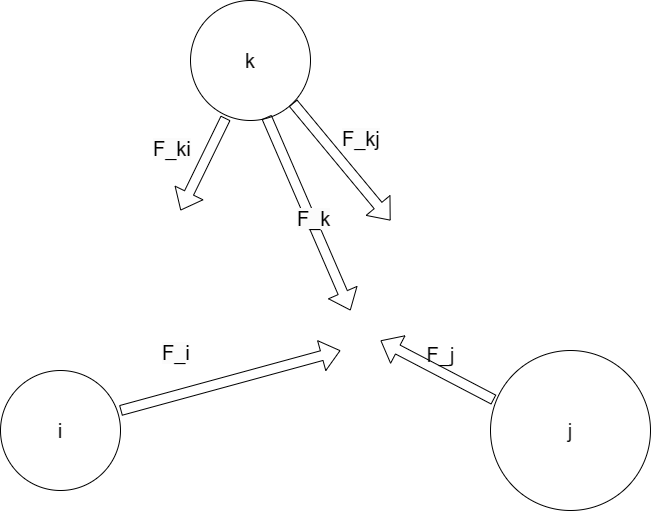

---

## Numerik

- gesucht: $\vec{x_i}(t)\,\,\text{mit}\,\, \vec{a_i}(t) = \frac{d^2}{d_t^2}\vec{x_i}(t)$
- DGLs 1. Ordnung: $\vec{a_i}(t) = \frac{d}{d_t}\vec{v_i}(t),\,\, \vec{v_i}(t) = \frac{d}{d_t}\vec{x_i}(t)$
- Eulerverfahren:

$t_{n+1} = t_{n} + h$

$v(t_{n+1}) = v(t_n) + h\cdot a(t_{n})$

$x(t_{n+1}) = x(t_n) + h\cdot v(t_{n})$

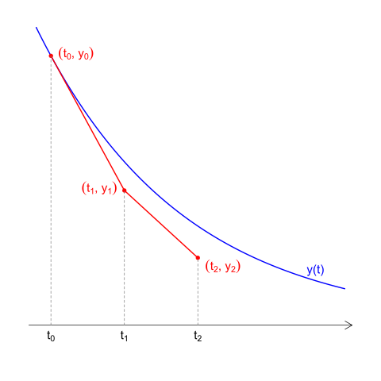

  <div style="font-size: 10px;position: absolute; right: 45px; bottom: 80px;" > <a href="https://commons.wikimedia.org/wiki/File:Euler_two_steps.svg">HilberTraum</a>, <a href="https://creativecommons.org/licenses/by-sa/4.0">CC BY-SA 4.0</a>, via Wikimedia Commons </div>

---

<h1 style="font-size: 10rem; text-align: center; position: absolute; left: 50%; top: 50%; transform: translate(-50%, -50%)">Umsetzung</h1>

---

## Umsetzung

- Grafikerfahrung im Web (HTML + CSS + TypeScript)
$\Rightarrow$ Leistung könnte mit Simulation knapp werden
- Simulation in Rust
- Server notwenidg (Rust)


---

## Kommunikation

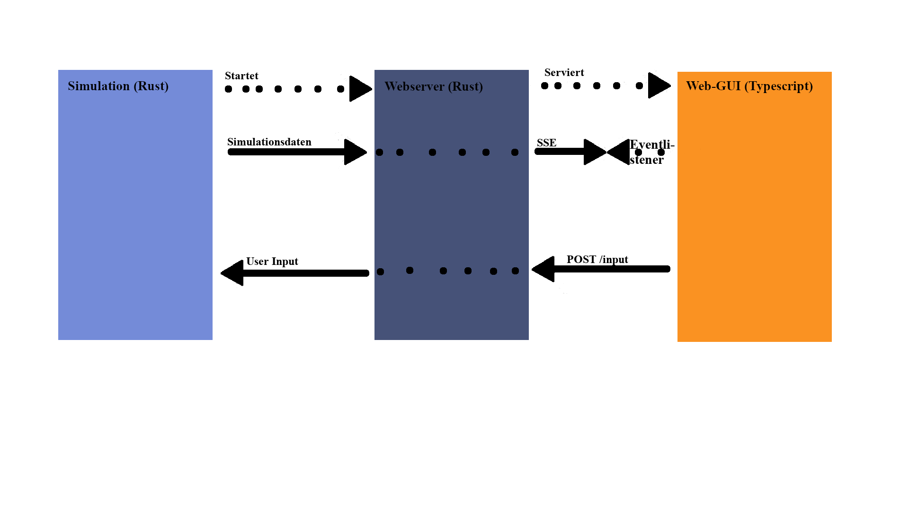

---

<h1 style="font-size: 10rem; text-align: center; position: absolute; left: 50%; top: 50%; transform: translate(-50%, -50%)">Simulation</h1>

---

## Simulation - Struktur


---

## Simulation - Ablauf

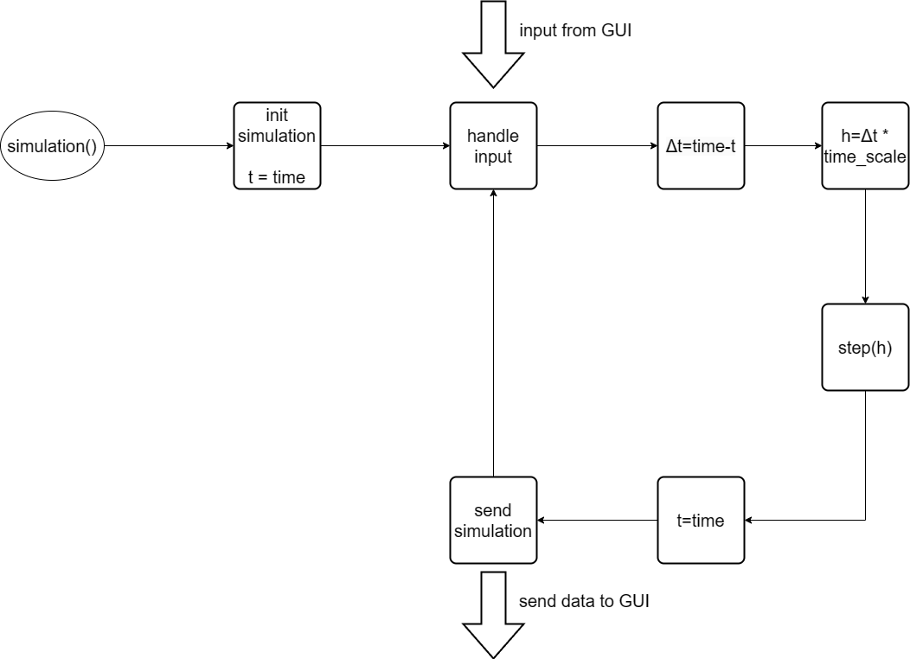

---

## Simulation - step
```rust
step(h: f64) {
  for i in 0..self.bodies.len() {
      for k in i + 1..self.bodies.len() {
          self.interact(i, k);
      }
  }
  
  for i in 0..self.bodies.len() {
      let body = &mut self.bodies[i];
      body.accelerate(h)
      body.movement(h)
  }
}
```
---

<h1 style="font-size: 10rem; text-align: center; position: absolute; left: 50%; top: 50%; transform: translate(-50%, -50%)">Server</h1>

---

## Server - Endpoints

- GET /simulation: 
öffnet Verbindung, um SSE zu senden

+ POST /input {eventtype, event}:
    - Add: erzeuge neuen Body, `event = new Body`
    - Remove: entferne einen Body, `event = {index: index}`
    - Update: modifiziere eine Body, `event = {index: Body}`
    - Meta: modifiziere MetaData, `event = {time_scale, interaction_constant}`

---

## Server - Ablauf

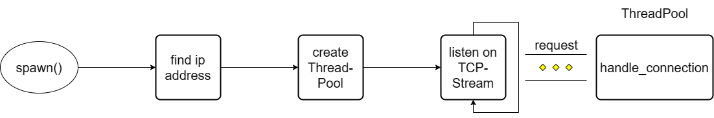

---

## Server - handle_connection

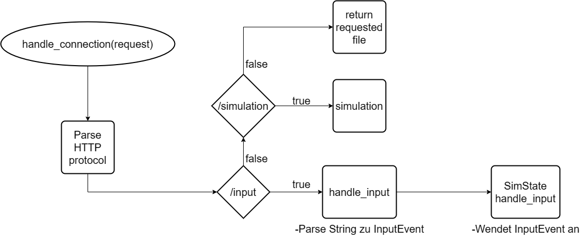

---

<h1 style="font-size: 10rem; text-align: center; position: absolute; left: 50%; top: 50%; transform: translate(-50%, -50%)">GUI</h1>

---


---

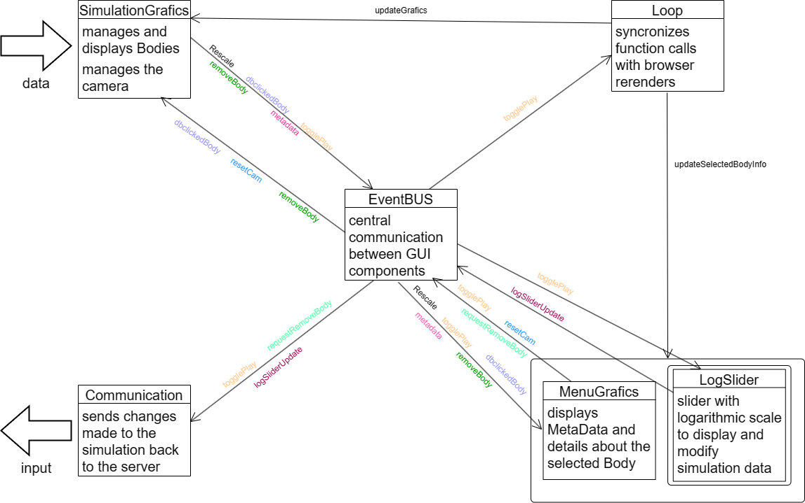

---

## Kollision

- keine Kollision implementiert
- Punktmassen kommen sich sehr nahe
$\Rightarrow a > 10^6 \frac{\text{m}}{\text{s}^2}$ möglich
- typisch: `time_scale = 1e6, h = 1e3` 
$\Rightarrow \Delta x > 10^{12}\, \text{m}$
- 2 Lösungen:
  - lösche Bodies mit $a > 10^6 \frac{\text{m}}{\text{s}^2}$
  - implementiere Kollision

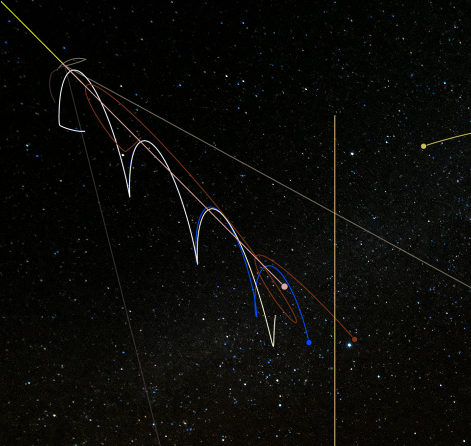

---

## Simulationsparameter modifizieren

- Slider zeigen aktuellen Wert der Simulationsparameter
$\Rightarrow$ pausiere GUI, um parameter zu ändern
- Problem: 1 Loop 
$\Rightarrow$ zeichnen wird auch pausiert 
$\Rightarrow$ unschöner Sprung
- 2 Lösungen:
    - Simulation pausieren
    - 2 Loops: einer zum Zeichnen, der andere für Parameter


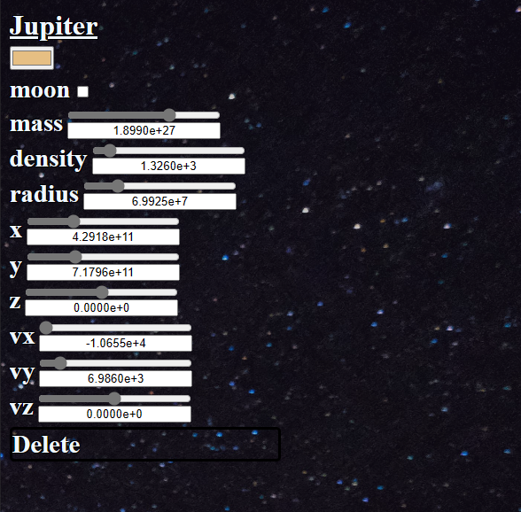

---

## Umlaufbahnen

- Speichere alle Position
um die Flugbahn zu zeichnen
- Problem: 
    - ewige Datenspeicherung
    - Speicher läuft voll
    - Performance nimmt drastisch ab
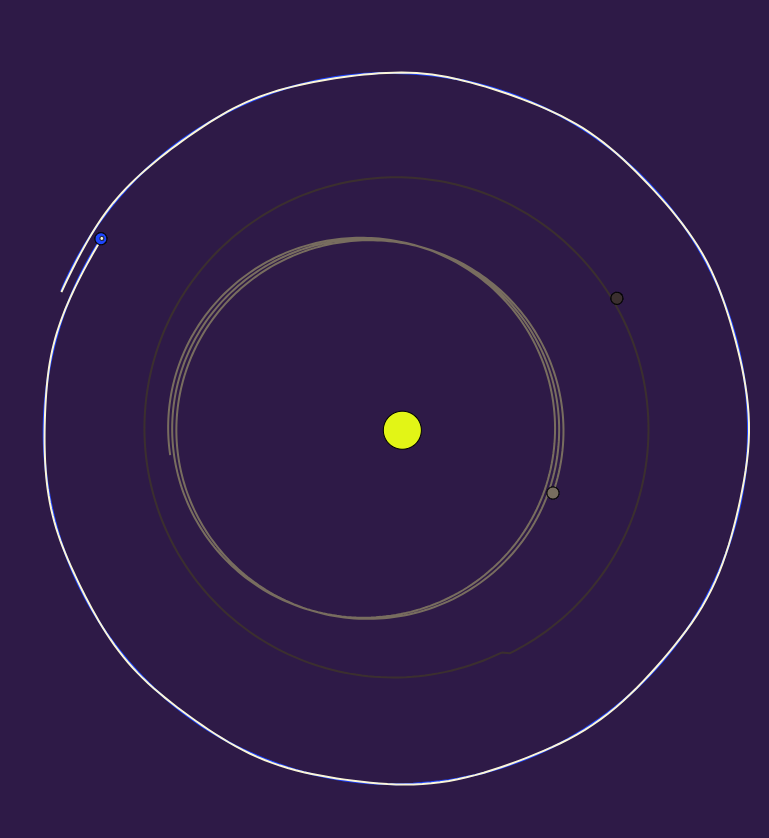

---

## Umlaufbahnen Optimisation

- Pollingrate proportional zum Radius
$\Rightarrow$ Weniger Datenpunkte
- Pfade schließen
$\Rightarrow$ Datenmenge beschränkt
- Beschleunigte Bewegung des Systems
$\Rightarrow$ Pfade nur selten schließbar

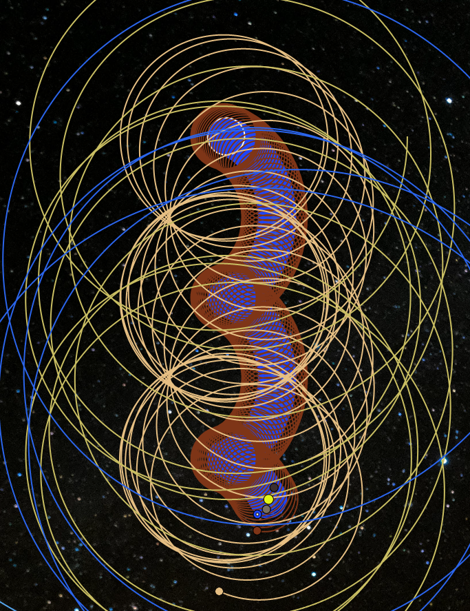

---

<iframe src="PLATZHALTERFORURL" title="Running Simulation" style="z-index: 1000; position: absolute; left: 0px; top: 0px; height: 100%; width: 100%; border: none; "></iframe>

---

## GUI - Loop

```typescript
const loop = (time: number) => {
  const delta = time - lastRender;
  if (delta >= 1000 / FPSTARGET) {
    updateFunctions.forEach((f) => f(delta));
    lastRender = time;
  }
  if (!end) window.requestAnimationFrame(loop);
};

const registerOnUpdate = (...onUpdate: ((delta: number) => any)[]) => {
  updateFunctions.push(...onUpdate);
};
```

---

## GUI - EventBUS

```ts

const eventTypes = ["togglePlay", "resetCam"] as const;
type Events = (typeof eventTypes)[number];
type EventDefinitions = {
  togglePlay: { play: boolean };
  resetCam: {};
};

const fireEvent = <K extends Events>(
  eventType: K,
  event: EventDefinitions[K]
) => {
  registeredFunctions[eventType].forEach((l) => l(event));
};
```
